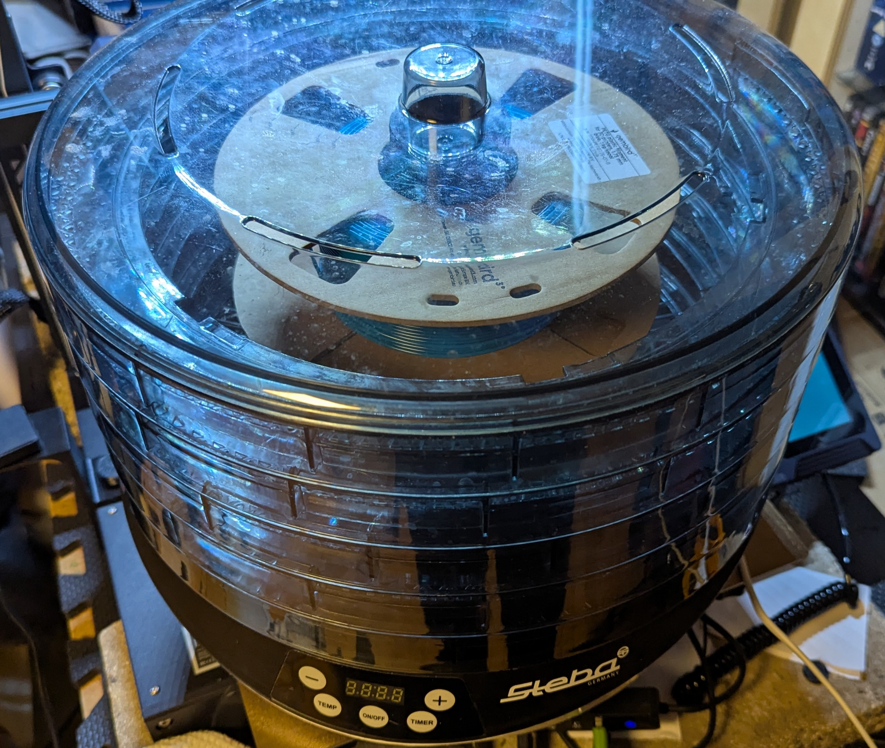
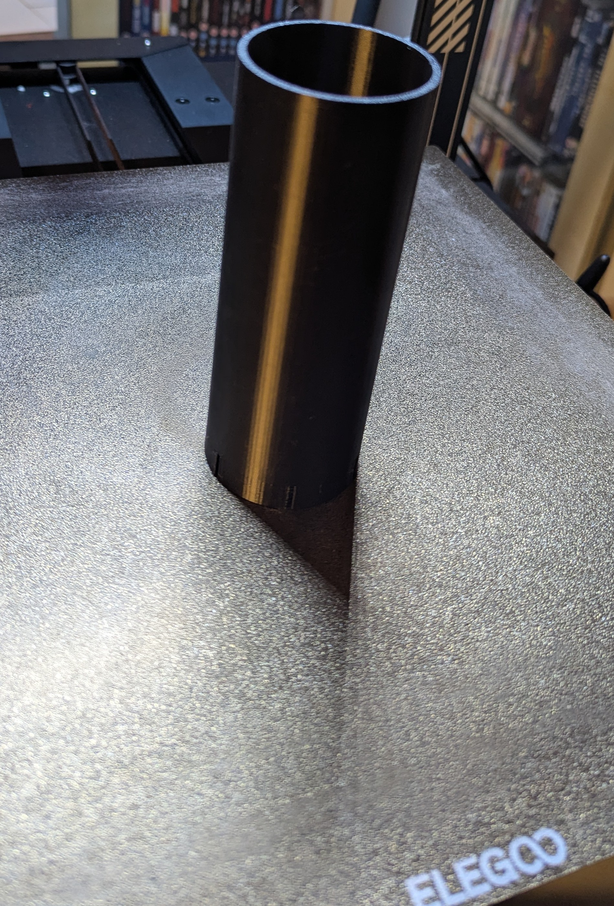
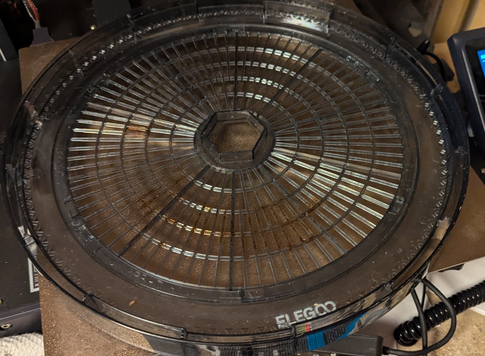
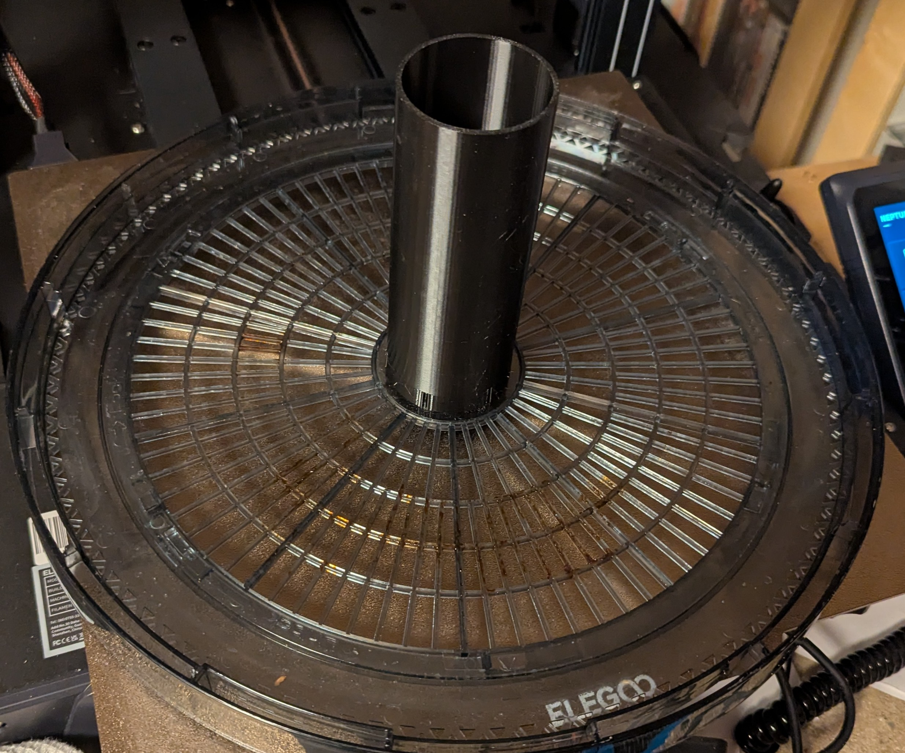
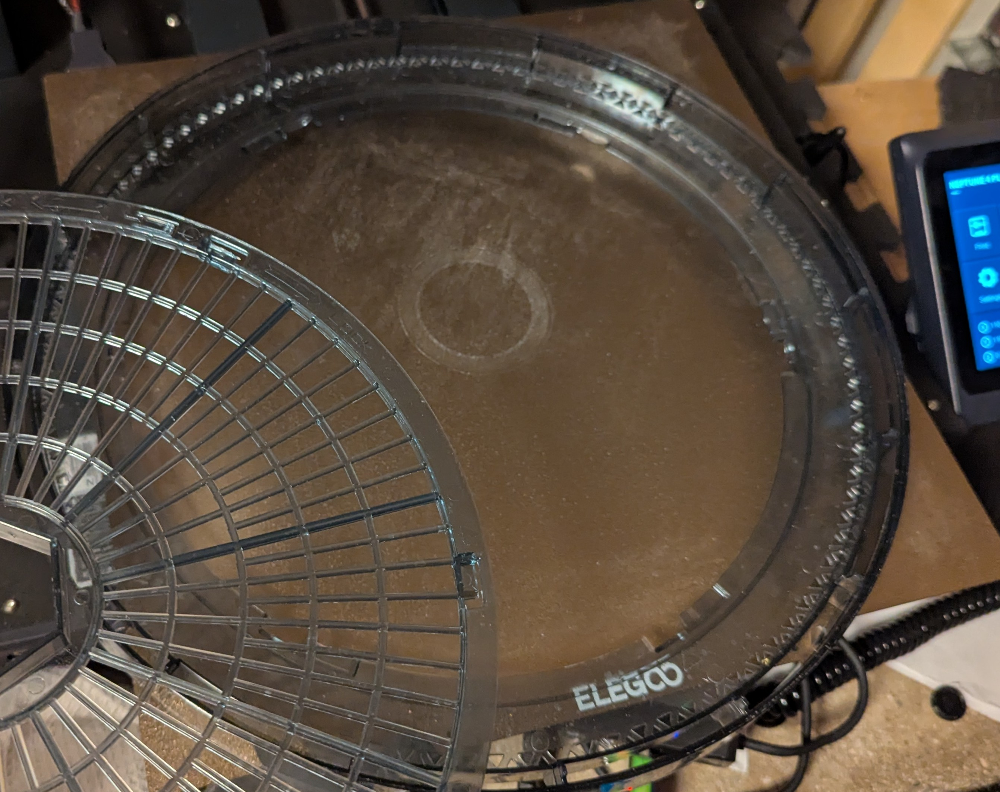
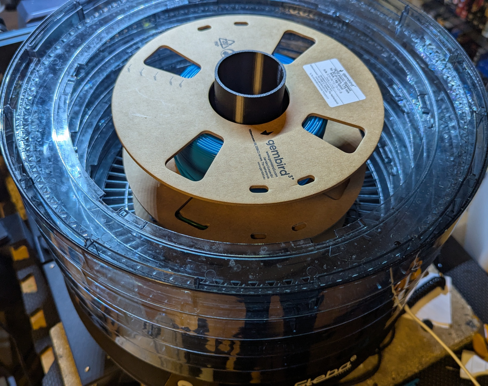

# Using a Steba ED8 as a filament dryer

The Steba ED8 works great as a filament dryer, the discs have a detachable middle piece, which is big enough for 1 kg filament spools.

This model is a small support piece to attach to the bottom disc, to hold the spools in-place.

There are two versions, a 148mm for two spools and a 74mm for a single spool.

## Assembling

1. Pick a disc for the bottom:
  
2. Attach the support to the disc:
  
3. Remove the middle part of the other discs:
  
4. Stack the discs as normal:
  
5. Done:
  
